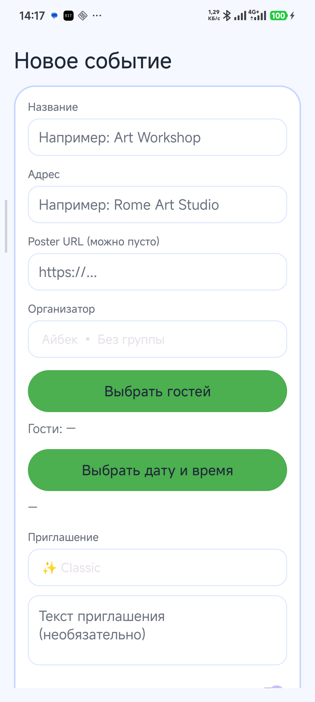
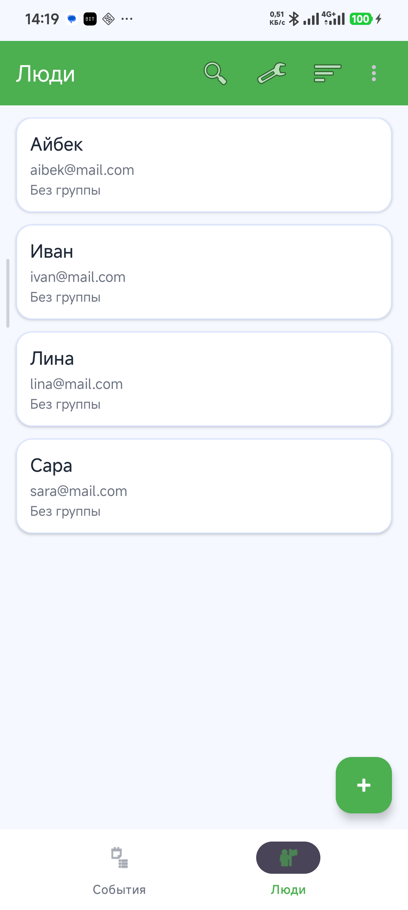
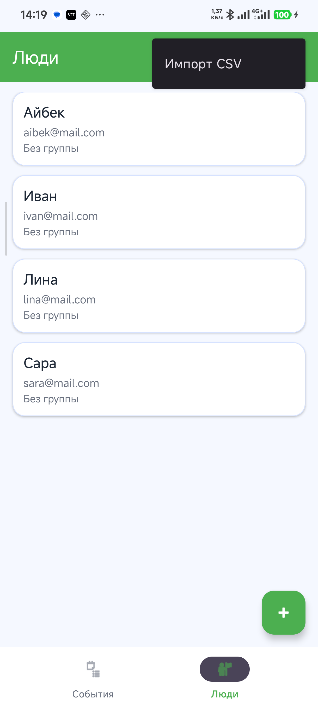

# Party Planner

Party Planner — мобильное Android-приложение для планирования мероприятий и управления списком гостей.

Приложение позволяет создавать события, приглашать гостей, управлять RSVP-статусами, организовывать гостей по группам и получать напоминания о предстоящих мероприятиях.

Проект разработан в рамках дисциплины «Мобильная разработка».

---

# Основные возможности

Приложение реализует следующие функции:

- создание и редактирование мероприятий
- управление списком гостей
- группировка гостей (семья, друзья, коллеги)
- RSVP-статусы участия (GOING / MAYBE / DECLINED)
- напоминания о мероприятиях
- импорт гостей из CSV
- фильтрация и сортировка гостей
- проверка конфликтов времени мероприятий
- синхронизация RSVP через Firebase Firestore
- локальное хранение данных через Room Database

---

# Скриншоты приложения

Главный экран

Экран создания события

Список гостей

Импорт гостей из CSV

---

# Архитектура приложения

Проект построен на архитектуре MVVM (Model – View – ViewModel).

View  
Activity и пользовательский интерфейс.

ViewModel  
Бизнес-логика и управление состоянием интерфейса.

Model  
Работа с данными (Room Database, Firebase Firestore, Repository).

---

# Используемые технологии

В проекте используются следующие технологии:

Java  
Android SDK  
MVVM архитектура  
Room Database  
LiveData / ViewModel  
RecyclerView  
Material Design Components  
WorkManager  
Retrofit  
Firebase Firestore  

---

# Структура проекта

app/

data/  
EventEntity  
PersonEntity  
EventGuestCrossRef  
PartyRepository  
EventDao  
PersonDao  

ui/  
MainActivity  
EditEventActivity  
PersonsActivity  
EventsViewModel  
PersonsViewModel  
Adapters  

reminders/  
ReminderScheduler  
Worker  

---

# База данных

В приложении используется локальная база данных Room.

Основные таблицы:

events  
Хранит информацию о мероприятиях.

persons  
Хранит информацию о гостях.

groups  
Хранит группы гостей.

event_guests  
Связующая таблица между событиями и гостями.

---

# Напоминания

Напоминания реализованы через WorkManager.

Пользователь может включить напоминание при создании события и выбрать время уведомления.  
После сохранения события приложение планирует задачу WorkManager, которая отправляет уведомление пользователю.

---

# Импорт гостей из CSV

Приложение поддерживает импорт списка гостей из CSV файла.

Формат CSV файла:

name,contacts,group

Во время импорта выполняется:

- добавление новых гостей
- проверка дубликатов
- автоматическое создание групп

---

# Установка и запуск

1. Установить Android Studio

https://developer.android.com/studio

2. Клонировать репозиторий

3. Открыть проект в Android Studio

File → Open → выбрать папку проекта

4. Подключить устройство или эмулятор Android

Минимальная версия Android: API 26 (Android 8.0)

5. Нажать Run

---

# Автор

Мелисов Айбек

Кыргызский государственный технический университет  
Кафедра информатики и вычислительной техники

---

# Лицензия

Проект разработан в учебных целях.